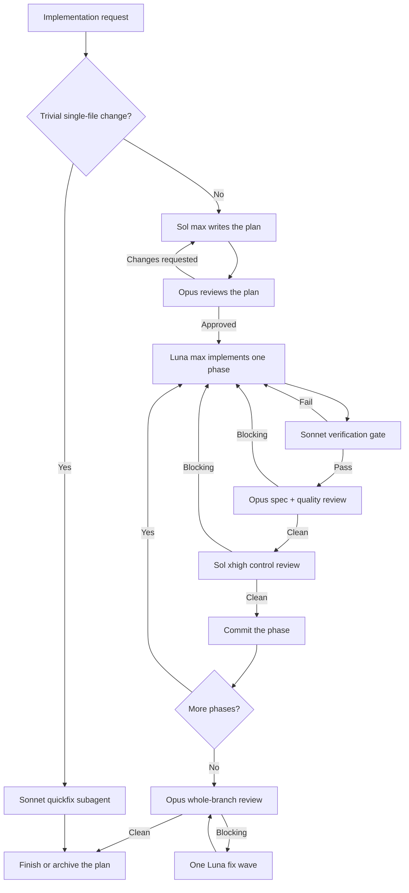

<div align="center">

# superpowers-strigov-ver

**A structured multi-model software delivery workflow for Claude Code.**

[Русская версия](./README.ru.md)


</div>

`superpowers-strigov-ver` is an opinionated Claude Code plugin that separates planning, implementation, verification, and review across several model roles. The main Claude thread stays focused on orchestration while fresh specialist agents do the judgment-heavy and code-writing work.

The goal is simple: produce a written plan before code, keep the implementer separate from its reviewers, make long tasks resumable, and refuse to call work complete until both phase-level and whole-branch checks are clean.

> Current source version: **0.6.1**

## Why this exists

A single-model workflow is convenient, but it creates predictable failure modes on non-trivial work:

- the model that wrote the code also grades it;
- implementation begins before requirements and interfaces are explicit;
- review rounds lose context or drift into scope expansion;
- interrupted sessions repeat work because progress lives only in chat history;
- a green phase can still break when combined with later phases.

This plugin turns those weak spots into explicit protocol stages with durable state, independent review, bounded loops, and human escalation when the models disagree.

## Highlights

- **Separation of duties** — different model families write and review the same artifact.
- **Plan-first execution** — implementation starts only after an Opus plan review.
- **Two-stage phase review** — Opus checks spec compliance and quality; Codex Sol performs an orthogonal control review.
- **Mechanical verification gate** — lint, typecheck, and affected tests run before every expensive review round.
- **Whole-branch merge gate** — a final Opus pass checks cross-phase integration and runs the full suite.
- **Durable resume** — YAML plan state, commit ranges, ledgers, reports, and thread-addressed Codex resume survive long sessions and compaction.
- **Review packages** — reviewers consume one generated file containing the commit list, stat, and full contextual diff.
- **Safe parallelism** — plan-marked independent phases can run in isolated Git worktrees, with a hard width cap of two.
- **Bounded review loops** — anti-ping-pong, no-progress detection, churn detection, and explicit round caps prevent endless agent loops.
- **Conservative Git behavior** — no force push, no amend, no skipped hooks, and no push without explicit approval in the current session.

## Model roles

These are the intended defaults used by the protocol:

| Role | Model | Responsibility |
|---|---|---|
| Orchestrator | Claude Sonnet | Triage, dispatch, polling, state transitions, and Git bookkeeping. It does not write production code. |
| Plan writer | GPT-5.6 Sol `max` | Explores the requested change, writes the implementation plan, and applies authorized plan revisions. |
| Plan reviewer | Claude Opus with `ultrathink` | Reviews the plan in a fresh context and blocks on material gaps or contradictions. |
| Implementer | GPT-5.6 Luna `max` | Implements non-frontend phases and handles authorized fix rounds. |
| Reasoning escalation | GPT-5.6 Terra `xhigh` | Continues a blocked implementation thread when the problem needs deeper reasoning. |
| Primary code reviewer | Claude Opus with `ultrathink` | Reviews both spec compliance and code quality on every phase (routine rounds). |
| Judgment escalation | Claude Fable 5 with `ultrathink` | Writes specs/ADRs in `brainstorming`; takes over the primary review on SECURITY/DATA_LOSS phases or from round 3; diagnoses BLOCKED; writes impasse summaries. Included in Max plans; explicit Opus fallback when the weekly Fable budget is out — never silent. |
| Control reviewer | GPT-5.6 Sol `xhigh` | Performs a fresh, read-only second opinion focused on edge cases, races, security, and regressions. |
| Verification and synthesis | Claude Sonnet | Runs mechanical gates and consolidates multi-round review history. |

`ultra` is never selected automatically. The plan writer uses it only when the user explicitly asks for `ultra` in their own request. Fable is likewise never a per-round default — it is the escalation tier for the judgment-heaviest, lowest-frequency dispatches.

## Workflow



### 1. Plan

Codex Sol writes `docs/plans/YYYY-MM-DD-<slug>.md` with YAML frontmatter and explicit sections for acceptance criteria, non-goals, global constraints, files, contracts, tests, risks, and phases. Every phase declares the interfaces it consumes and produces.

### 2. Plan review and pre-flight

A fresh Opus subagent reviews the plan. Blocking findings are triaged into an authorization ledger before Sol is allowed to revise anything. After approval, the orchestrator performs a narrow pre-flight scan for conflicting global constraints, broken `Consumes`/`Produces` links, and plan-mandated defects.

### 3. Implement and verify

Luna implements one phase at a time. Frontend-only phases can be routed to a Claude frontend implementer. Before review, a Sonnet verification gate runs the relevant lint, typecheck, and tests. A red gate returns directly to the implementer without consuming a review round.

### 4. Fused phase review

Each round starts by generating a review package with `bin/review-package`. Opus reviews spec compliance and quality; only a clean Opus verdict triggers the fresh Sol control review. Accepted findings go back to the original implementer through thread-addressed resume. Multi-round reviews are synthesized into `docs/reviews/`.

### 5. Commit and continue

After both reviewers are clean, the orchestrator updates plan state and creates a conventional commit for the phase. It stages files by name, preserves unrelated work, never amends, and never pushes without explicit user approval.

### 6. Final whole-branch review

After the final phase, a fresh Opus subagent reviews the entire branch from its merge base, checks cross-phase contracts and architecture, and runs the full test suite plus typecheck/lint. One consolidated Luna fix wave is allowed before the second and final review round.

## Safety and control

| Guard | Behavior |
|---|---|
| Main-thread isolation | The orchestrator does not write production code or research the codebase itself. |
| Authorization ledger | Review feedback is triaged before any fixer receives it; out-of-scope changes are not silently implemented. |
| Anti-ping-pong | A finding rejected with recorded reasoning cannot be reintroduced unchanged. |
| No-progress detector | Identical blocking lists in consecutive rounds escalate immediately. |
| New-blocker churn detector | Late low-materiality findings cannot keep a converged review loop alive forever. |
| Review caps | Plan and phase review loops cap at four rounds; final whole-branch review caps at two. |
| Human authority | Plan-mandated conflicts, scope expansion, and unresolved review impasses are escalated to the user. |
| Git safety | No `--no-verify`, no `--amend`, no force push, and no push without current-session approval. |

## Installation

### Requirements

- A recent version of **Claude Code**.
- The standalone **Codex CLI**:

  ```bash
  npm install -g @openai/codex
  ```

- A one-time Codex login on each machine:

  ```bash
  codex login
  ```

  From inside Claude Code, prefix shell commands with `!`, for example `!codex login`.

You do **not** need OpenAI's separate `codex-plugin-cc` Claude Code plugin. The required companion runtime is vendored in this repository.

### Install from the marketplace

Run these commands in Claude Code:

```text
/plugin marketplace add strigov/strigov-cc-plugins
/plugin install superpowers-strigov-ver@strigov-cc-plugins
/reload-plugins
```

To update later:

```text
/plugin update superpowers-strigov-ver@strigov-cc-plugins
```

## Usage

Start the full protocol explicitly:

```text
/dev Implement resumable uploads with integrity checks
```

Or describe an implementation task normally. The `dev-orchestrator` skill recognizes implementation requests in English and Russian and performs triage automatically.

Trivial edits—such as a typo, rename, or obvious one-line fix—take the Sonnet quickfix path without invoking the full review protocol.

## What is included

### Fork-specific skills

| Skill | Purpose |
|---|---|
| `dev-orchestrator` | The complete multi-model planning, implementation, review, commit, and resume protocol. |
| `codex-invocation` | Reliable background Codex dispatch through the vendored companion runtime. |
| `codex-ask` | A grounded, read-only Codex second opinion, threaded by topic. |
| `architecture-memory` | Maintains a compact, persistent `docs/ARCHI.md` architecture map. |

The plugin also includes the `/dev` command and the helper scripts `bin/codex-dispatch`, `bin/sdd-workspace`, and `bin/review-package`.

### Bundled upstream skills

The repository carries adapted, namespace-stripped versions of these Superpowers skills:

`brainstorming`, `dispatching-parallel-agents`, `executing-plans`, `finishing-a-development-branch`, `receiving-code-review`, `requesting-code-review`, `systematic-debugging`, `test-driven-development`, `using-git-worktrees`, `verification-before-completion`, `writing-plans`, and `writing-skills`.

The upstream `subagent-driven-development` skill is replaced by `dev-orchestrator`. The aggressive `using-superpowers` injection and SessionStart hook are intentionally not included.

## Repository layout

```text
.
├── .claude-plugin/plugin.json       # Plugin manifest and source version
├── commands/dev.md                  # /dev command entry point
├── bin/
│   ├── codex-dispatch               # Vendored companion wrapper
│   ├── review-package               # Reviewer-ready diff package generator
│   └── sdd-workspace                # Per-plan scratch workspace resolver
├── skills/
│   ├── dev-orchestrator/            # Protocol and role prompt templates
│   ├── codex-invocation/
│   ├── codex-ask/
│   ├── architecture-memory/
│   └── ...                          # Adapted Superpowers skills
├── tests/test-sdd-scripts.sh        # Workspace/package integration tests
└── vendor/codex-companion/          # Vendored OpenAI companion runtime
```

## Vendored Codex companion

All Codex calls go through `bin/codex-dispatch`. The wrapper resolves the vendored runtime from either a marketplace installation or a local checkout and isolates its state under `~/.claude/plugins/data/superpowers-strigov-ver-codex`.

The current vendored base is recorded in `vendor/codex-companion/VERSION`. Local patches add thread-addressed `task --resume-task <task-id>`, GPT-5.6 `max`/`ultra` reasoning efforts, broker cleanup, and optional review authorization fields. Reapply those patches whenever the upstream runtime is updated.

## Development and release checks

Run the integration suite:

```bash
bash tests/test-sdd-scripts.sh
```

For a release, keep the version synchronized in:

- `.claude-plugin/plugin.json`;
- `README.md` and `README.ru.md`;
- `PLUGIN_README.md`;
- the `superpowers-strigov-ver` entry in the external [`strigov-cc-plugins` marketplace catalog](https://github.com/strigov/strigov-cc-plugins).

Updating this source repository alone does not publish a new marketplace version—the catalog entry must be bumped separately.

## Attribution

- [Superpowers](https://github.com/obra/superpowers) by Jesse Vincent / obra — MIT. This fork carries adapted skills from v5.0.7 and selected, source-verified mechanisms from Superpowers 6 v6.1.1.
- [TRIP-workflow](https://github.com/PiLastDigit/TRIP-workflow) by PiLastDigit — MIT. Thread-addressed resume, the verification gate, review synthesis, `codex-ask`, and architecture-memory concepts were adapted from this project.
- The vendored Codex companion runtime originates from OpenAI's `codex-plugin-cc` and remains under Apache-2.0; see `vendor/codex-companion/LICENSE` and `NOTICE`.

## License

The original work in this repository is released under the [MIT License](./LICENSE). Vendored components retain their respective licenses.
