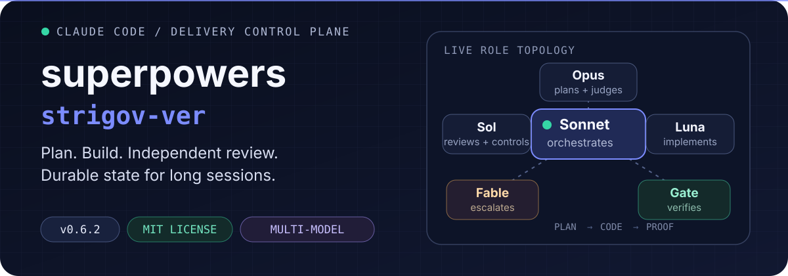
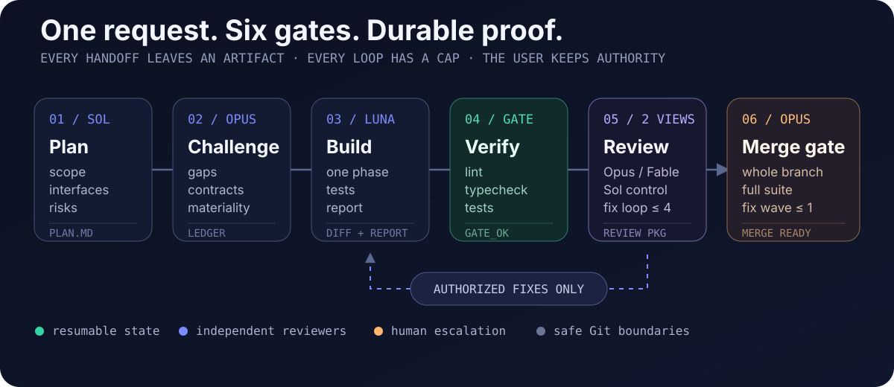

<p align="center">
  
</p>

<p align="center">
  <a href="./README.ru.md"><strong>Читать на русском</strong></a>
  ·
  <a href="#quick-start">Quick start</a>
  ·
  <a href="#delivery-protocol">Protocol</a>
  ·
  <a href="#model-roles">Models</a>
  ·
  <a href="#inside-the-plugin">Contents</a>
</p>

<p align="center">
  
  
  
</p>

`superpowers-strigov-ver` turns Claude Code into a structured software-delivery system. One model orchestrates, specialized models plan and implement, independent reviewers challenge the result, and every important handoff leaves a durable artifact.

> **The outcome:** long implementation tasks can survive context compaction, review loops stay bounded, and code does not reach “done” until phase-level and whole-branch gates are clean.

## Quick start

### 1. Install the prerequisites

You need a recent **Claude Code**, the standalone **Codex CLI**, and a one-time Codex login:

```bash
npm install -g @openai/codex
codex login
```

### 2. Install the plugin

Run in Claude Code:

```text
/plugin marketplace add strigov/strigov-cc-plugins
/plugin install superpowers-strigov-ver@strigov-cc-plugins
/reload-plugins
```

The companion runtime is already vendored. OpenAI's separate `codex-plugin-cc` Claude Code plugin is **not** required.

### 3. Ship a real task

```text
/dev Implement resumable uploads with integrity checks
```

You can also describe the implementation task normally. The plugin recognizes English and Russian requests and performs triage automatically. Trivial single-file edits take a lightweight Sonnet quickfix path.

## What changes

| Default agent workflow | This plugin |
|---|---|
| One model plans, writes, and grades its own work | Different model families write and review each artifact |
| Progress lives mainly in chat context | Plans, ledgers, reports, diffs, and task IDs make progress resumable |
| Review can expand scope or loop indefinitely | Authorization rules, churn detection, and hard round caps bound every loop |
| A green phase can still hide integration failures | A final whole-branch review checks contracts and runs the full suite |

## Delivery protocol

<p align="center">
  
</p>

1. **Plan** — Codex Sol writes a durable implementation plan with scope, interfaces, global constraints, tests, and risks.
2. **Challenge** — a fresh Opus reviewer finds material gaps; authorized corrections return to the original Sol thread.
3. **Build** — Luna implements one phase and writes a report. Terra can continue the same thread when deeper reasoning is required.
4. **Verify** — a Sonnet gate runs lint, typecheck, and affected tests before expensive review begins.
5. **Review twice** — Opus checks spec compliance and quality, then a fresh Sol control review probes edge cases, races, security, and regressions. Fable takes the primary judgment role for SECURITY/DATA_LOSS phases or from round three, with an explicit Opus fallback.
6. **Gate the branch** — after all phases pass, a fresh Opus review checks the complete branch and full test suite. One consolidated Luna fix wave is allowed before the final verdict.

Every Codex continuation is thread-addressed with `--resume-task <task-id>`. Reviewers receive a generated package containing the commit list, stat, and contextual diff instead of reconstructing the change from chat history.

## Model roles

- **Orchestrator · Claude Sonnet** — triage, dispatch, polling, state transitions, and safe Git bookkeeping. Never writes production code.
- **Plan writer · GPT-5.6 Sol `max`** — explores the task, writes the plan, and applies authorized plan revisions.
- **Plan reviewer · Claude Opus + `ultrathink`** — reviews the plan in a fresh context and blocks on material gaps.
- **Implementer · GPT-5.6 Luna `max`** — implements non-frontend phases and authorized fix rounds.
- **Reasoning escalation · GPT-5.6 Terra `xhigh`** — continues a blocked implementation thread when more reasoning is needed.
- **Primary code reviewer · Claude Opus + `ultrathink`** — checks spec compliance and code quality in routine rounds.
- **Judgment escalation · Claude Fable 5 + `ultrathink`** — handles high-risk/late review rounds, BLOCKED diagnosis, and impasse summaries; explicit Opus fallback.
- **Control reviewer · GPT-5.6 Sol `xhigh`** — supplies a fresh, read-only second opinion after the primary review clears.
- **Verification and synthesis · Claude Sonnet** — runs mechanical gates and consolidates multi-round review history.

`ultra` is never chosen automatically. The Sol plan writer uses it only when the user explicitly requests it.

## Guardrails

- **Independent judgment** — the writer and reviewer of an artifact come from different model families.
- **Authorization ledger** — review feedback is triaged before a fixer receives it; scope expansion is never silently implemented.
- **Bounded loops** — plan and phase reviews cap at four rounds; final whole-branch review caps at two.
- **No review ping-pong** — rejected findings cannot return unchanged, identical blocker lists escalate, and late low-materiality churn cannot keep a converged loop alive.
- **Human authority** — plan conflicts, material scope changes, and unresolved impasses return to the user.
- **Safe Git** — no `--no-verify`, no amend, no force push, and no push without explicit approval in the current session.
- **Isolated parallelism** — plan-marked independent phases may run in separate worktrees, with a hard concurrency width of two.

## Inside the plugin

### Fork-specific capabilities

| Component | Purpose |
|---|---|
| `dev-orchestrator` | Complete planning, implementation, verification, review, commit, and resume protocol |
| `codex-invocation` | Reliable background Codex dispatch through the vendored companion runtime |
| `codex-ask` | Grounded, read-only Codex second opinions with one thread per topic |
| `architecture-memory` | Compact persistent architecture map in `docs/ARCHI.md` |
| `/dev` | Explicit entry point for the full delivery protocol |
| `bin/review-package` | Generates reviewer-ready commit and diff packages |
| `bin/sdd-workspace` | Resolves isolated per-plan scratch workspaces |

### Adapted Superpowers skills

`brainstorming`, `dispatching-parallel-agents`, `executing-plans`, `finishing-a-development-branch`, `receiving-code-review`, `requesting-code-review`, `systematic-debugging`, `test-driven-development`, `using-git-worktrees`, `verification-before-completion`, `writing-plans`, and `writing-skills`.

The upstream `subagent-driven-development` skill is replaced by `dev-orchestrator`. The aggressive `using-superpowers` injection and SessionStart hook are intentionally not included.

<details>
<summary><strong>Repository map</strong></summary>

```text
.
├── .claude-plugin/plugin.json       # Plugin manifest and source version
├── commands/dev.md                  # /dev command entry point
├── bin/
│   ├── codex-dispatch               # Vendored companion wrapper
│   ├── review-package               # Reviewer-ready diff package generator
│   └── sdd-workspace                # Per-plan scratch workspace resolver
├── skills/
│   ├── dev-orchestrator/            # Protocol and role prompt templates
│   ├── codex-invocation/
│   ├── codex-ask/
│   ├── architecture-memory/
│   └── ...                          # Adapted Superpowers skills
├── tests/test-sdd-scripts.sh        # Workspace/package integration tests
└── vendor/codex-companion/          # Vendored OpenAI companion runtime
```

</details>

<details>
<summary><strong>Vendored Codex companion</strong></summary>

All Codex calls go through `bin/codex-dispatch`. The wrapper works from a marketplace installation or local checkout and isolates state under `~/.claude/plugins/data/superpowers-strigov-ver-codex`.

The upstream base is recorded in `vendor/codex-companion/VERSION`. Local patches add thread-addressed resume, GPT-5.6 `max`/`ultra` reasoning efforts, broker cleanup, and optional review-authorization fields.

</details>

## Development and releases

Run the integration suite:

```bash
bash tests/test-sdd-scripts.sh
```

For a release, synchronize the version in `.claude-plugin/plugin.json`, both README files, `PLUGIN_README.md`, and the plugin entry in the external [`strigov-cc-plugins` marketplace catalog](https://github.com/strigov/strigov-cc-plugins). Updating this repository alone does not publish a marketplace release.

## Provenance

- [Superpowers](https://github.com/obra/superpowers) by Jesse Vincent / obra — MIT. This fork includes adapted v5.0.7 skills and selected source-verified mechanisms from Superpowers 6 v6.1.1.
- [TRIP-workflow](https://github.com/PiLastDigit/TRIP-workflow) by PiLastDigit — MIT. Thread-addressed resume, verification gates, review synthesis, `codex-ask`, and architecture-memory concepts were adapted from this project.
- The vendored Codex companion originates from OpenAI's `codex-plugin-cc` and retains its Apache-2.0 license.

## License

Original work in this repository is released under the [MIT License](./LICENSE). Vendored components retain their respective licenses.
