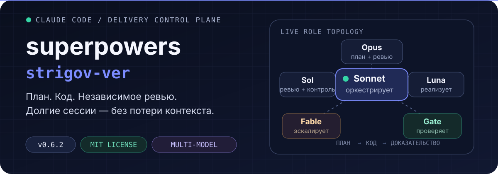
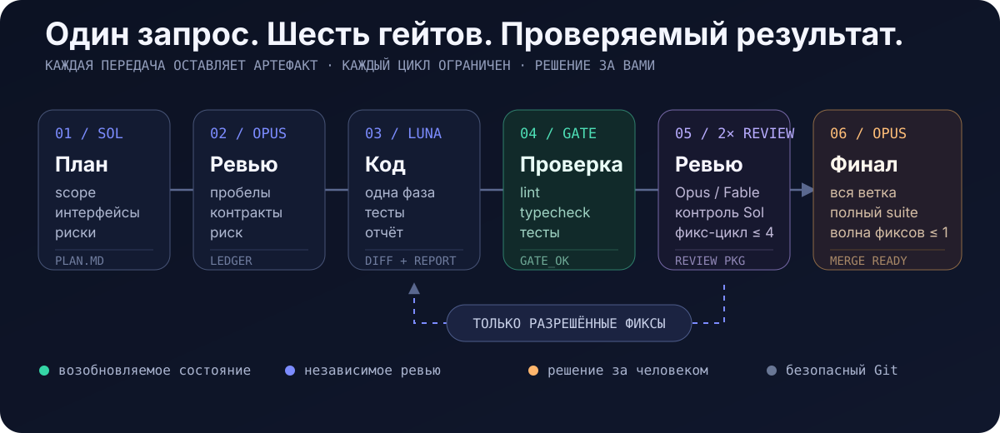

<p align="center">
  
</p>

<p align="center">
  <a href="./README.md"><strong>Read in English</strong></a>
  ·
  <a href="#быстрый-старт">Быстрый старт</a>
  ·
  <a href="#протокол-разработки">Протокол</a>
  ·
  <a href="#роли-моделей">Модели</a>
  ·
  <a href="#что-входит-в-плагин">Состав</a>
</p>

<p align="center">
  
  
  
</p>

`superpowers-strigov-ver` превращает Claude Code в структурированную систему разработки. Одна модель оркестрирует процесс, специализированные модели планируют и пишут код, независимые ревьюеры проверяют результат, а каждая важная передача оставляет долговечный артефакт.

> **Результат:** длинные задачи переживают compaction контекста, циклы ревью остаются ограниченными, а код не считается готовым, пока не пройдены гейты фазы и всей ветки.

## Быстрый старт

### 1. Установите зависимости

Нужны актуальный **Claude Code**, отдельный **Codex CLI** и однократный вход в Codex:

```bash
npm install -g @openai/codex
codex login
```

### 2. Установите плагин

Выполните в Claude Code:

```text
/plugin marketplace add strigov/strigov-cc-plugins
/plugin install superpowers-strigov-ver@strigov-cc-plugins
/reload-plugins
```

Companion runtime уже вендорится. Отдельный Claude Code-плагин OpenAI `codex-plugin-cc` **не нужен**.

### 3. Запустите реальную задачу

```text
/dev Реализуй возобновляемую загрузку файлов с проверкой целостности
```

Можно и просто описать задачу обычным текстом. Плагин распознаёт английские и русские запросы и сам выполняет триаж. Тривиальные правки одного файла идут по облегчённому пути Sonnet quickfix.

## Что меняется

| Обычный агентный процесс | Этот плагин |
|---|---|
| Одна модель планирует, пишет и сама оценивает свою работу | Каждый артефакт пишут и ревьюят разные модельные семейства |
| Прогресс живёт в основном в контексте чата | Планы, ledger, отчёты, diff и task ID позволяют возобновлять работу |
| Ревью может расширять scope или циклиться | Правила авторизации, детекторы churn и жёсткие лимиты ограничивают каждый цикл |
| Зелёная фаза может скрывать интеграционные ошибки | Финальное ревью всей ветки проверяет контракты и запускает полный suite |

## Протокол разработки

<p align="center">
  
</p>

1. **План** — Codex Sol пишет долговечный план со scope, интерфейсами, глобальными ограничениями, тестами и рисками.
2. **Критика** — свежий Opus-ревьюер ищет материальные пробелы; разрешённые правки возвращаются в исходный тред Sol.
3. **Реализация** — Luna реализует одну фазу и пишет отчёт. Terra может продолжить тот же тред, если нужно более глубокое reasoning.
4. **Верификация** — Sonnet-гейт запускает lint, typecheck и затронутые тесты до начала дорогого ревью.
5. **Два ревью** — Opus проверяет соответствие плану и качество, затем свежий Sol ищет граничные случаи, гонки, уязвимости и регрессии. Fable забирает основное суждение на фазах SECURITY/DATA_LOSS или с третьего раунда, с явным фолбэком на Opus.
6. **Гейт ветки** — после всех фаз свежий Opus проверяет всю ветку и полный набор тестов. До финального вердикта разрешена одна объединённая волна фиксов Luna.

Каждое продолжение Codex адресуется через `--resume-task <task-id>`. Ревьюеры получают сгенерированный пакет со списком коммитов, статистикой и контекстным diff, а не восстанавливают изменения из истории чата.

## Роли моделей

- **Оркестратор · Claude Sonnet** — триаж, dispatch, polling, переходы состояния и безопасный Git-bookkeeping. Не пишет production-код.
- **Автор плана · GPT-5.6 Sol `max`** — исследует задачу, пишет план и вносит разрешённые правки.
- **Ревьюер плана · Claude Opus + `ultrathink`** — в свежем контексте ищет материальные пробелы плана.
- **Имплементер · GPT-5.6 Luna `max`** — реализует нефронтендовые фазы и разрешённые fix-раунды.
- **Эскалация reasoning · GPT-5.6 Terra `xhigh`** — продолжает заблокированный тред, когда нужно больше reasoning.
- **Основной ревьюер кода · Claude Opus + `ultrathink`** — проверяет соответствие плану и качество в обычных раундах.
- **Эскалация суждения · Claude Fable 5 + `ultrathink`** — берёт рисковые/поздние раунды, BLOCKED-диагностику и impasse-summary; явный фолбэк на Opus.
- **Контрольный ревьюер · GPT-5.6 Sol `xhigh`** — даёт свежую read-only вторую оценку после чистого основного ревью.
- **Верификация и синтез · Claude Sonnet** — запускает механические гейты и объединяет историю многораундового ревью.

`ultra` никогда не выбирается автоматически. Автор плана Sol использует его только по явному запросу пользователя.

## Защитные механизмы

- **Независимое суждение** — автор и ревьюер артефакта принадлежат разным модельным семействам.
- **Authorization ledger** — замечания проходят триаж до передачи фиксеру; расширение scope не реализуется молча.
- **Ограниченные циклы** — ревью плана и фазы ограничено четырьмя раундами, финальное ревью ветки — двумя.
- **Без review ping-pong** — отклонённые замечания не возвращаются без нового основания, одинаковые списки блокеров эскалируются, а поздний малозначимый churn не может бесконечно удерживать цикл.
- **Власть человека** — конфликты с планом, материальное расширение scope и неразрешимые тупики возвращаются пользователю.
- **Безопасный Git** — без `--no-verify`, amend, force push и push без явного согласия в текущей сессии.
- **Изолированный параллелизм** — независимые фазы из плана могут идти в отдельных worktree с жёстким лимитом параллелизма два.

## Что входит в плагин

### Собственные возможности форка

| Компонент | Назначение |
|---|---|
| `dev-orchestrator` | Полный протокол планирования, реализации, верификации, ревью, коммитов и возобновления |
| `codex-invocation` | Надёжный фоновый dispatch Codex через вендорный companion runtime |
| `codex-ask` | Обоснованное read-only второе мнение Codex с отдельным тредом на тему |
| `architecture-memory` | Компактная персистентная карта архитектуры в `docs/ARCHI.md` |
| `/dev` | Явная точка входа в полный протокол |
| `bin/review-package` | Генерирует готовые для ревьюера пакеты коммитов и diff |
| `bin/sdd-workspace` | Резолвит изолированные scratch-workspace для каждого плана |

### Адаптированные скиллы Superpowers

`brainstorming`, `dispatching-parallel-agents`, `executing-plans`, `finishing-a-development-branch`, `receiving-code-review`, `requesting-code-review`, `systematic-debugging`, `test-driven-development`, `using-git-worktrees`, `verification-before-completion`, `writing-plans` и `writing-skills`.

Upstream-скилл `subagent-driven-development` заменён на `dev-orchestrator`. Агрессивная инъекция `using-superpowers` и SessionStart hook намеренно не включены.

<details>
<summary><strong>Карта репозитория</strong></summary>

```text
.
├── .claude-plugin/plugin.json       # Манифест и версия исходников
├── commands/dev.md                  # Точка входа команды /dev
├── bin/
│   ├── codex-dispatch               # Обёртка вендорного companion
│   ├── review-package               # Генератор diff-пакета для ревьюеров
│   └── sdd-workspace                # Резолвер scratch-workspace для плана
├── skills/
│   ├── dev-orchestrator/            # Протокол и шаблоны промптов ролей
│   ├── codex-invocation/
│   ├── codex-ask/
│   ├── architecture-memory/
│   └── ...                          # Адаптированные скиллы Superpowers
├── tests/test-sdd-scripts.sh        # Интеграционные тесты workspace/package
└── vendor/codex-companion/          # Вендорный companion runtime OpenAI
```

</details>

<details>
<summary><strong>Вендорный Codex companion</strong></summary>

Все вызовы Codex идут через `bin/codex-dispatch`. Обёртка работает из marketplace-установки или локального checkout и изолирует состояние в `~/.claude/plugins/data/superpowers-strigov-ver-codex`.

Upstream-база записана в `vendor/codex-companion/VERSION`. Локальные патчи добавляют адресный resume, reasoning-efforts `max`/`ultra` для GPT-5.6, очистку broker-процессов и необязательные поля авторизации ревью.

</details>

## Разработка и выпуски

Запуск интеграционного suite:

```bash
bash tests/test-sdd-scripts.sh
```

Для выпуска синхронизируйте версию в `.claude-plugin/plugin.json`, обоих README, `PLUGIN_README.md` и записи плагина во внешнем [каталоге marketplace `strigov-cc-plugins`](https://github.com/strigov/strigov-cc-plugins). Обновление только этого репозитория не публикует новую marketplace-версию.

## Происхождение

- [Superpowers](https://github.com/obra/superpowers) от Jesse Vincent / obra — MIT. Форк включает адаптированные скиллы v5.0.7 и отдельные, проверенные по исходникам механизмы Superpowers 6 v6.1.1.
- [TRIP-workflow](https://github.com/PiLastDigit/TRIP-workflow) от PiLastDigit — MIT. Отсюда адаптированы адресный resume, verification gate, синтез ревью, `codex-ask` и концепция architecture memory.
- Вендорный Codex companion происходит из `codex-plugin-cc` OpenAI и сохраняет лицензию Apache-2.0.

## Лицензия

Оригинальная часть репозитория опубликована по [лицензии MIT](./LICENSE). Вендорные компоненты сохраняют свои лицензии.
