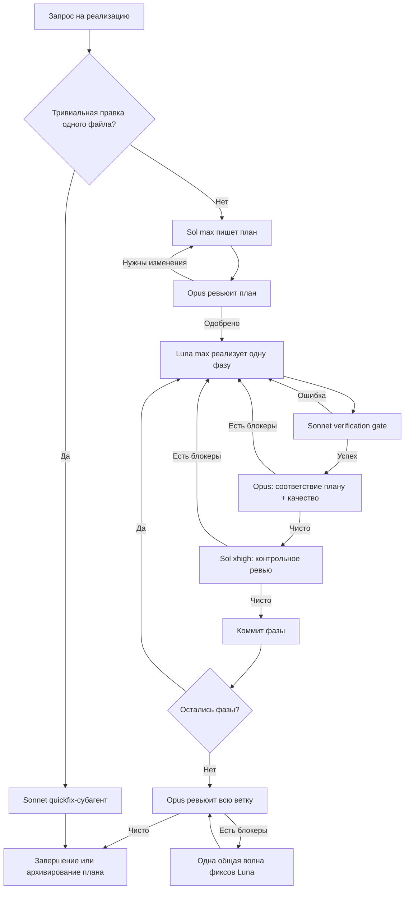

<div align="center">

# superpowers-strigov-ver

**Структурированный многомодельный процесс разработки для Claude Code.**

[English version](./README.md)


</div>

`superpowers-strigov-ver` — это opinionated-плагин для Claude Code, который распределяет планирование, реализацию, верификацию и ревью между несколькими модельными ролями. Главный поток Claude занимается оркестрацией, а написание кода и задачи, требующие суждения, выполняют специализированные агенты.

Цель проста: получить письменный план до начала реализации, отделить имплементера от ревьюеров, сделать длинные задачи возобновляемыми и не объявлять работу завершённой до чистого ревью каждой фазы и всей ветки целиком.

> Текущая версия исходников: **0.6.1**

## Зачем это нужно

Одномодельный процесс удобен, но на нетривиальных задачах у него появляются предсказуемые слабые места:

- модель, которая написала код, сама же его оценивает;
- реализация начинается до фиксации требований и интерфейсов;
- раунды ревью теряют контекст или незаметно расширяют scope;
- после прерванной сессии работа повторяется, потому что прогресс остался только в истории чата;
- каждая фаза по отдельности может быть зелёной, но их объединение всё равно ломает систему.

Плагин превращает эти риски в явные стадии протокола с персистентным состоянием, независимым ревью, ограниченными циклами и эскалацией к человеку, когда модели не могут договориться.

## Главное

- **Разделение ответственности** — один артефакт пишут и проверяют разные модельные семьи.
- **Сначала план** — реализация начинается только после ревью плана моделью Opus.
- **Двухступенчатое ревью фазы** — Opus проверяет соответствие спецификации и качество, затем Codex Sol выполняет ортогональную контрольную проверку.
- **Механический verification gate** — lint, typecheck и затронутые тесты запускаются до каждого дорогого раунда ревью.
- **Финальный гейт всей ветки** — Opus проверяет интеграцию между фазами и запускает полный набор тестов.
- **Надёжное возобновление** — YAML-состояние плана, диапазоны коммитов, ledger, отчёты и адресный resume тредов Codex переживают длинные сессии и compaction.
- **Пакеты для ревью** — ревьюер получает один файл со списком коммитов, статистикой и полным diff с контекстом.
- **Безопасный параллелизм** — независимые фазы, явно отмеченные в плане, могут выполняться в отдельных Git worktree с жёстким лимитом ширины два.
- **Ограниченные циклы** — anti-ping-pong, детектор отсутствия прогресса, детектор churn и лимиты раундов не дают агентам зациклиться.
- **Консервативная работа с Git** — без force push, amend, пропуска хуков и push без явного согласия в текущей сессии.

## Роли моделей

Протокол использует следующие роли по умолчанию:

| Роль | Модель | Ответственность |
|---|---|---|
| Оркестратор | Claude Sonnet | Триаж, dispatch, polling, переходы состояния и Git-bookkeeping. Не пишет production-код. |
| Автор плана | GPT-5.6 Sol `max` | Исследует задачу, пишет план реализации и вносит только разрешённые правки плана. |
| Ревьюер плана | Claude Opus с `ultrathink` | В свежем контексте проверяет план и блокирует материальные пробелы или противоречия. |
| Имплементер | GPT-5.6 Luna `max` | Реализует нефронтендовые фазы и выполняет разрешённые fix-раунды. |
| Эскалация reasoning | GPT-5.6 Terra `xhigh` | Продолжает заблокированный тред реализации, когда задаче нужно более глубокое рассуждение. |
| Основной ревьюер кода | Claude Opus с `ultrathink` | На каждой фазе проверяет соответствие плану и качество кода (обычные раунды). |
| Эскалация суждения | Claude Fable 5 с `ultrathink` | Пишет спеки/ADR в `brainstorming`; забирает основное ревью на фазах SECURITY/DATA_LOSS или с 3-го раунда; диагностирует BLOCKED; пишет impasse-summary. Входит в Max-подписку; при исчерпании недельного бюджета Fable — явный фолбэк на Opus, никогда молча. |
| Контрольный ревьюер | GPT-5.6 Sol `xhigh` | Даёт свежую read-only вторую оценку: граничные случаи, гонки, безопасность и регрессии. |
| Верификация и синтез | Claude Sonnet | Запускает механические гейты и объединяет историю многораундового ревью. |

`ultra` никогда не выбирается автоматически. Автор плана использует его только тогда, когда пользователь явно попросил `ultra` в своём запросе. Fable точно так же никогда не дефолт пер-раундовых циклов — это эскалационный тир для самых редких и самых важных по суждению диспатчей.

## Рабочий процесс



### 1. План

Codex Sol создаёт `docs/plans/YYYY-MM-DD-<slug>.md` с YAML-frontmatter и явными разделами: acceptance criteria, non-goals, глобальные ограничения, файлы, контракты, тесты, риски и фазы. Каждая фаза объявляет интерфейсы, которые она потребляет и производит.

### 2. Ревью плана и pre-flight

Свежий Opus-субагент ревьюит план. Блокирующие замечания сначала проходят триаж в authorization ledger, и только после этого Sol разрешено менять план. После одобрения оркестратор выполняет узкий pre-flight scan: ищет конфликты глобальных ограничений, разорванные связи `Consumes`/`Produces` и дефекты, которые прямо предписывает план.

### 3. Реализация и верификация

Luna реализует по одной фазе. Фронтендовые фазы могут маршрутизироваться Claude-имплементеру. Перед ревью Sonnet запускает нужные lint, typecheck и тесты. Красный гейт возвращает работу имплементеру и не расходует раунд ревью.

### 4. Слитое ревью фазы

Каждый раунд начинается с генерации review package через `bin/review-package`. Opus проверяет соответствие плану и качество; только чистый вердикт Opus запускает свежий контрольный review модели Sol. Принятые замечания возвращаются исходному имплементеру через адресный resume треда. История многораундового ревью сохраняется в `docs/reviews/`.

### 5. Коммит и следующая фаза

После чистого вердикта обоих ревьюеров оркестратор обновляет состояние плана и создаёт conventional commit фазы. Файлы стейджатся по именам, посторонняя работа сохраняется, amend не используется, push без явного согласия запрещён.

### 6. Финальное ревью всей ветки

После последней фазы свежий Opus-субагент проверяет всю ветку от merge base, сверяет межфазные контракты и архитектуру, запускает полный набор тестов и typecheck/lint. До второго и последнего раунда разрешена одна объединённая волна исправлений Luna.

## Защитные механизмы

| Механизм | Поведение |
|---|---|
| Изоляция главного потока | Оркестратор не пишет production-код и сам не исследует кодовую базу. |
| Authorization ledger | Замечания проходят триаж до передачи фиксеру; изменения вне scope не реализуются молча. |
| Anti-ping-pong | Отклонённое с зафиксированной аргументацией замечание нельзя повторно внести без нового основания. |
| Детектор отсутствия прогресса | Одинаковые списки блокеров в двух последовательных раундах немедленно эскалируют. |
| Детектор новых блокеров | Поздние малозначимые замечания не могут бесконечно удерживать уже сошедшийся цикл ревью. |
| Лимиты ревью | Ревью плана и фазы ограничено четырьмя раундами; финальное ревью всей ветки — двумя. |
| Власть пользователя | Конфликты с планом, расширение scope и неразрешимые разногласия эскалируются человеку. |
| Безопасность Git | Без `--no-verify`, `--amend`, force push и push без согласия в текущей сессии. |

## Установка

### Требования

- Актуальная версия **Claude Code**.
- Отдельный **Codex CLI**:

  ```bash
  npm install -g @openai/codex
  ```

- Однократный вход в Codex на каждой машине:

  ```bash
  codex login
  ```

  Внутри Claude Code добавьте префикс `!`, например `!codex login`.

Отдельный Claude Code-плагин OpenAI `codex-plugin-cc` **не требуется**. Нужный companion runtime уже вендорится в этом репозитории.

### Установка из marketplace

Выполните в Claude Code:

```text
/plugin marketplace add strigov/strigov-cc-plugins
/plugin install superpowers-strigov-ver@strigov-cc-plugins
/reload-plugins
```

Последующее обновление:

```text
/plugin update superpowers-strigov-ver@strigov-cc-plugins
```

## Использование

Явный запуск полного протокола:

```text
/dev Реализуй возобновляемую загрузку файлов с проверкой целостности
```

Можно и просто описать задачу на реализацию обычным текстом. Скилл `dev-orchestrator` распознаёт запросы на английском и русском языках и автоматически выполняет триаж.

Тривиальные изменения — опечатка, переименование или очевидный однострочный фикс — идут по быстрому пути Sonnet quickfix без полного протокола ревью.

## Что входит в плагин

### Собственные скиллы форка

| Скилл | Назначение |
|---|---|
| `dev-orchestrator` | Полный многомодельный протокол планирования, реализации, ревью, коммитов и возобновления. |
| `codex-invocation` | Надёжный фоновый dispatch Codex через вендорный companion runtime. |
| `codex-ask` | Обоснованное read-only второе мнение Codex с отдельным тредом на тему. |
| `architecture-memory` | Поддерживает компактную персистентную карту архитектуры `docs/ARCHI.md`. |

Также входят команда `/dev` и вспомогательные скрипты `bin/codex-dispatch`, `bin/sdd-workspace` и `bin/review-package`.

### Скиллы из upstream

Репозиторий содержит адаптированные версии следующих скиллов Superpowers без исходного namespace:

`brainstorming`, `dispatching-parallel-agents`, `executing-plans`, `finishing-a-development-branch`, `receiving-code-review`, `requesting-code-review`, `systematic-debugging`, `test-driven-development`, `using-git-worktrees`, `verification-before-completion`, `writing-plans` и `writing-skills`.

Upstream-скилл `subagent-driven-development` заменён на `dev-orchestrator`. Агрессивная инъекция `using-superpowers` и SessionStart hook намеренно не включены.

## Структура репозитория

```text
.
├── .claude-plugin/plugin.json       # Манифест и версия исходников
├── commands/dev.md                  # Точка входа команды /dev
├── bin/
│   ├── codex-dispatch               # Обёртка вендорного companion
│   ├── review-package               # Генератор пакета diff для ревьюеров
│   └── sdd-workspace                # Резолвер scratch-workspace для плана
├── skills/
│   ├── dev-orchestrator/            # Протокол и шаблоны промптов ролей
│   ├── codex-invocation/
│   ├── codex-ask/
│   ├── architecture-memory/
│   └── ...                          # Адаптированные скиллы Superpowers
├── tests/test-sdd-scripts.sh        # Интеграционные тесты workspace/package
└── vendor/codex-companion/          # Вендорный companion runtime OpenAI
```

## Вендорный Codex companion

Все вызовы Codex проходят через `bin/codex-dispatch`. Обёртка находит вендорный runtime как в marketplace-установке, так и в локальном checkout, и изолирует его состояние в `~/.claude/plugins/data/superpowers-strigov-ver-codex`.

Текущая базовая версия вендорного runtime записана в `vendor/codex-companion/VERSION`. Локальные патчи добавляют адресный `task --resume-task <task-id>`, reasoning-efforts `max`/`ultra` для GPT-5.6, очистку broker-процессов и необязательные поля авторизации ревью. После обновления upstream runtime эти патчи нужно наложить заново.

## Проверка и выпуск версии

Запуск интеграционных тестов:

```bash
bash tests/test-sdd-scripts.sh
```

Перед выпуском версии синхронизируйте номер в:

- `.claude-plugin/plugin.json`;
- `README.md` и `README.ru.md`;
- `PLUGIN_README.md`;
- записи `superpowers-strigov-ver` во внешнем [каталоге marketplace `strigov-cc-plugins`](https://github.com/strigov/strigov-cc-plugins).

Обновление только этого репозитория не публикует новую версию в marketplace — номер в каталоге нужно поднять отдельно.

## Атрибуция

- [Superpowers](https://github.com/obra/superpowers) от Jesse Vincent / obra — MIT. Форк содержит адаптированные скиллы из v5.0.7 и отдельные, проверенные по исходникам механизмы Superpowers 6 v6.1.1.
- [TRIP-workflow](https://github.com/PiLastDigit/TRIP-workflow) от PiLastDigit — MIT. Отсюда адаптированы адресный resume тредов, verification gate, синтез ревью, `codex-ask` и концепция architecture memory.
- Вендорный Codex companion происходит из `codex-plugin-cc` OpenAI и остаётся под Apache-2.0; см. `vendor/codex-companion/LICENSE` и `NOTICE`.

## Лицензия

Оригинальная часть этого репозитория опубликована под [лицензией MIT](./LICENSE). Вендорные компоненты сохраняют собственные лицензии.
